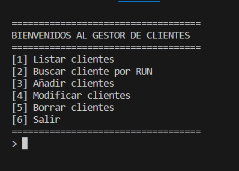
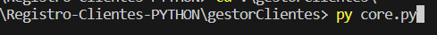
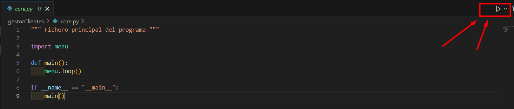

# Registro-Clientes-PYTHON
Programa sencillo ejecudado mediante consola en Visual Studio Code, utilizando el archivo core.py.

CRUD de clientes, se busca, modifica y borra al cliente mediante el RUN que lo identifica (ID).




# Iniciar programa
Mediante consola se escribe el siguiente comando:
```
  py core.py
```




# Cerrar programa
Con el comando **CTRL + C** se cancela el proceso o selecciona la opción **6**.


